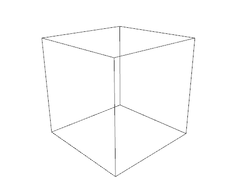
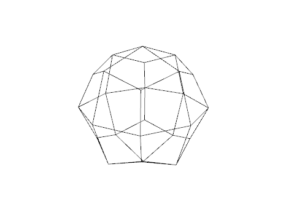
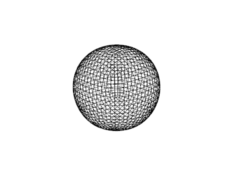
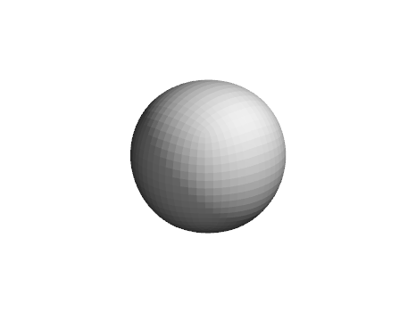
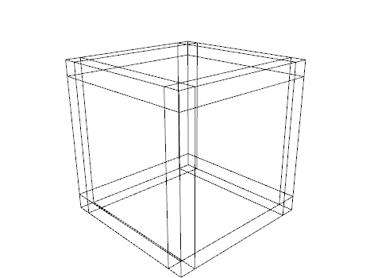
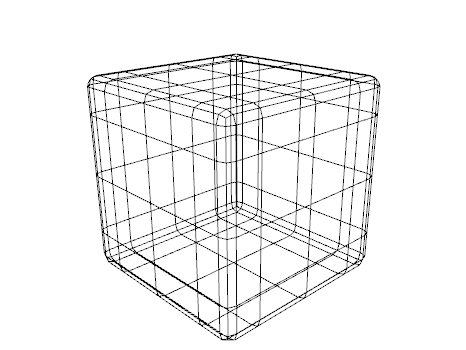
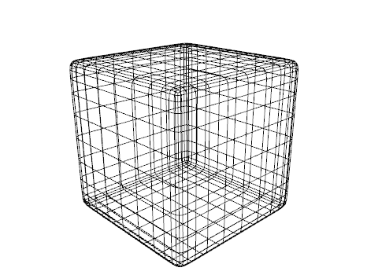
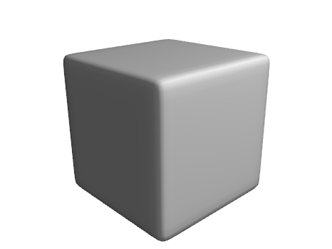

# ofxQuad

ofxQuad is an OpenFrameworks addon for creating meshes based on quads instead
of triangles. ofxQuad also contains an implementation of the Catmull-Clark
subdivision surface algorithm for subdividing a mesh into a smoother mesh.

## Example

The following code creates a cube using six quad faces:

```
Quad quad;

auto v0 = quad.addVertex({100.0, -100.0, 100.0});
auto v1 = quad.addVertex({100.0, 100.0, 100.0});
auto v2 = quad.addVertex({-100.0, 100.0, 100.0});
auto v3 = quad.addVertex({-100.0, -100.0, 100.0});
auto v4 = quad.addVertex({100.0, -100.0, -100.0});
auto v5 = quad.addVertex({-100.0, -100.0, -100.0});
auto v6 = quad.addVertex({-100.0, 100.0, -100.0});
auto v7 = quad.addVertex({100.0, 100.0, -100.0});

quad.addFace(v0, v1, v2, v3);
quad.addFace(v4, v5, v6, v7);
quad.addFace(v0, v4, v7, v1);
quad.addFace(v3, v2, v6, v5);
quad.addFace(v1, v7, v6, v2);
quad.addFace(v0, v3, v5, v4);
```

which rendered as a wireframe looks like this:



Rendering with one subdivision surface iteration creates a smoother mesh:



rendering with four subdivision surface iterations:



rendering with four iterations and flat shading:



rendering with four iterations and smooth shading:


## Another Example

A cube with edge loops to create rounded edges:










## Demo

The "example" directory contains a demo program that shows how to use ofxQuad.
